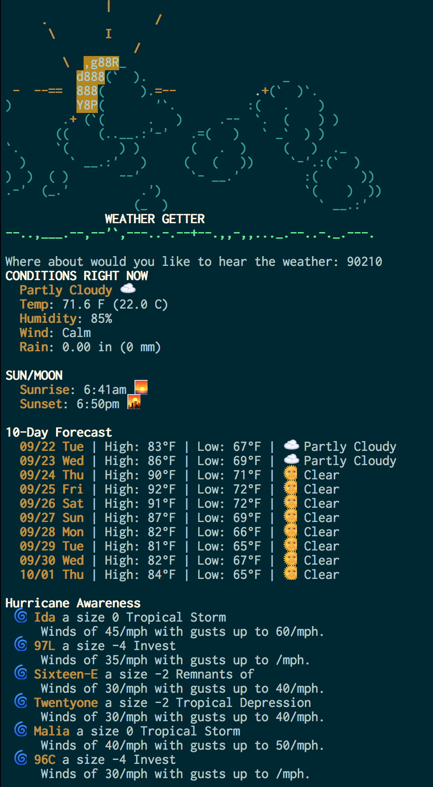

# Weather Underground CLI Interface

## Description
This program was a homework assignment for one night at the Iron Yard. See this (source)[https://github.com/tiyd-rails-2015-08/weather_report]

We practiced Test Driven Development while estimating the time it would take to develop. My original estimate was 8 hours to develop this program, and it took about 12 hours instead (too many rabbit holes, _emojis_!)

## Usage
At the BASH terminal, run `ruby cli.rb` to start the interactive prompt. At this moment, you'll only be able to put in zip codes, or STATE/CITY (ie `NC/Raleigh`) formatted locations.

You will need to supply your own Weather Underground API key. You can register for one here: http://www.wunderground.com/weather/api/

Once you have your key, put it into your Bash profile by doing this:
`echo "EXPORT WUNDERGROUND_API=myapikey" >> ~/.bash_profile`
and then restart your terminal for it to take effect.

## Screenshot

## Powered by (Weather Underground)[http://www.wunderground.com/]

## TODO
- [x] Enhance with the super powers of emojis
- [x] Be awesome.
- [ ] Make input more flexible with some regular expressions
- [ ] Save the API Key some grief by caching requests into a local sqlite3 database
- [ ] Some of the API responses are pretty dumb; add some common-sense checks so things like " /mph" show up without any context.